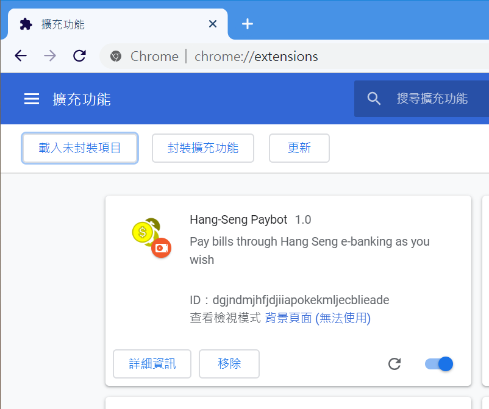
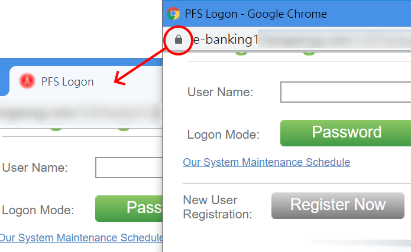
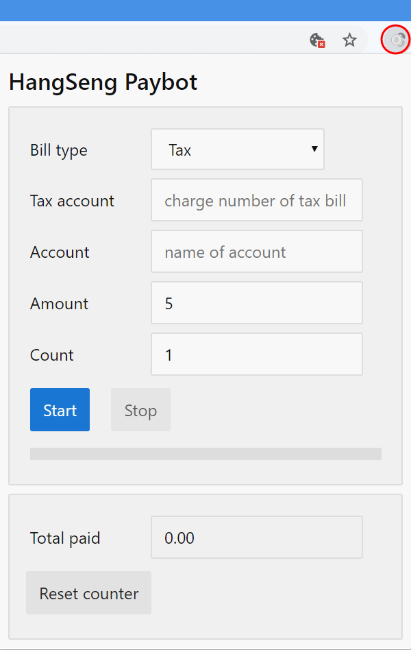

# HangSeng Paybot

## Description

Chrome extension to automate tax or other bill payment via HangSeng e-banking, in small amount repeatedly.

This extension simulates user actions, e.g. filling form, clicking buttons, etc.

## Installation

1. Download the latest ZIP file release from: <https://github.com/freelancer2047/hangseng-paybot/releases>

2. Unzip the file

3. Type the URL `chrome://extensions` in Chrome and turn on Developer mode at the top right corner

4. Click the "Load unpacked extension" button and select the unzipped folder, the folder should contain `manifest.json` file

5. If the extension is listed in the extensions page, it is installed successfully.

## Usage

1. Open the e-banking site in Chrome, and login Personal e-banking. This opens a new browser window.

2. Move the page to a regular multi-tabbed Chrome window by dragging the icon at the top left corner.

3. Click the decolorized paybot icon in Chrome to open the paybot popup.

4. For tax payment:
   * select "Tax" as "Bill type"
   * type the tax account number with dashs (-) removed
   * type the name of your Credit card displayed in the e-banking site (follow the exact letter case)
   * adjust the amount in HKD for each payment
   * adjust the count of repeated payment to make

5. Click "Start" to begin. 

6. Watch the paybot do its job. Observe the progress through the progress bar, and total amount paid in the "Total paid" field. You may stop and restart any time you wish. Total paid amount will not be cleared unless the "Reset counter" button is clicked.

## Tips

The paybot works in background, so you can dismiss the paybot popup while it is working. The paybot icon turns yellow when it is working, and returns to the decolorized appearance when it stop.

## Disclaimer

The author is not responsible for any loss caused by the script, so use at your own risk and study the source code to protect yourself. You are advised to check payment history and/or make screen recording to make sure the paybot works as expected.

## Acknowledgements

Inspired by [chrome-ppshk-pay-bot](https://github.com/freehk-developer/chrome-ppshk-pay-bot)
